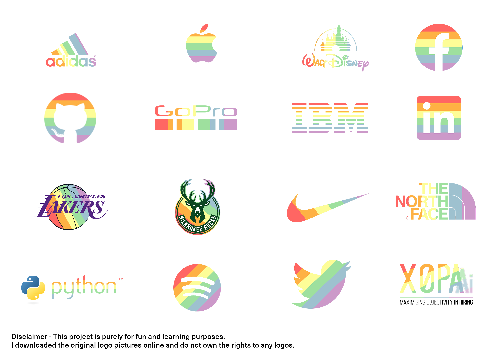
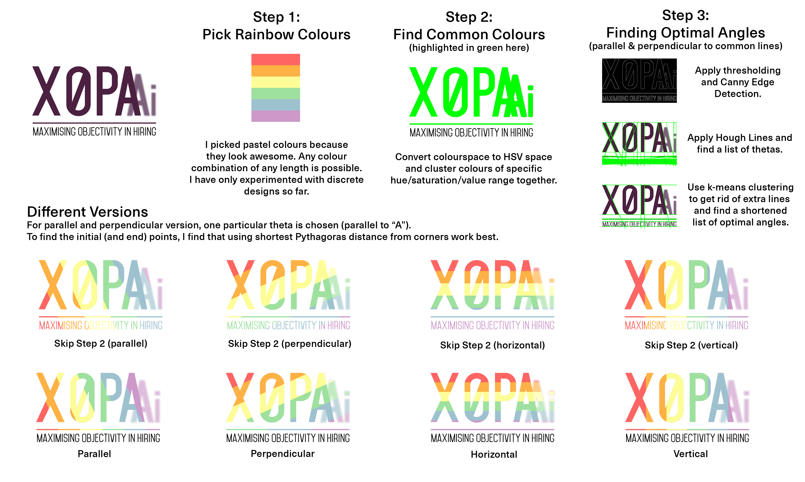
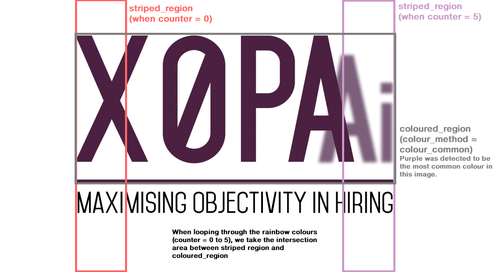
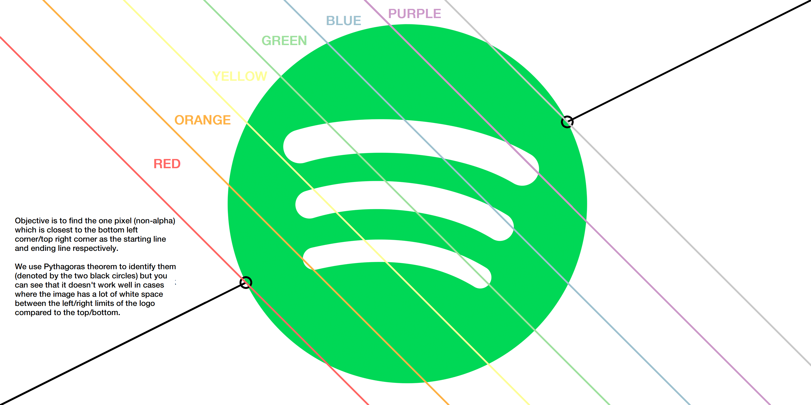
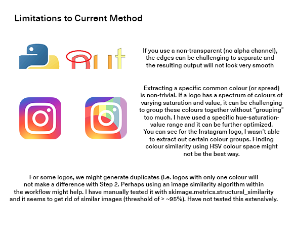

# Rainbow-ify company logos!

Convert company or brand logos colours into rainbow (pride) colours! This was inspired by Pride Month.

Figure 1.1

The objective has always been learning and code readability for this pet project. I have tried to be as detailed without being too detailed in the comments. While classes are more elegant, functions are easier to understand so the entire project is broken into functions. If you are unsure why I wrote a certain line or would like to provide feedback, feel free to reach out at my email at **dewei274@gmail.com** or through my LinkedIn profile. Thank you for reading! 

## Algorithm Design

Figure 1.2

Figure 2.1

Figure 2.2

### Helper Functions

| Function  | Brief Explanation |
| ------------- | ------------------ |
| convert_alpha_to_white  | Remove alpha channel (to white background) for visualization  |
| convert_src_to_alpha | Converts images with opaque (white) background into transparent image |
| generate_rainbow_codes | Generate a list of bgr/rgb codes from hex codes |
| detect_optimal_angle| Detect optimal angles starting from vertical line (clockwise) |
| find_colour_breakdown | Find the most common colour |
| generate_logo_wrapper  | Wrapper Function |

#### Colour Methods

Return an array of image shape as selected region as True. (coloured_region)

| Function  | Brief Explanation |
| ------------- | ------------- |
| colour_all  | Convert all colours  |
| colour_common | Convert the most common colour |
| colour_blackwhite | Convert black/white pixels or vice versa |

### Transform Methods

Transform an alpha source by modifying the selected striped_region.

| Function  | Brief Explanation |
| ------------- | ------------- |
| transform_axis  | Transform vertically/horizontally  |
| transform_optimal | Transform with an optimal angle |

## Requirements/Installation for Windows (Skip if you already know this)

This project requires a Python (>=3.6). This is because I use f-strings in the project.

If you are new, you can click on "Clone or download" on top, download the ZIP file and save it on your computer. If you already have
git installed, run this on your command prompt.

    git clone https://github.com/kennycdw/rainbow-logos.git

Once done, you need to install several packages before running the programme.

    cd pride-rainbow
    pip install -r requirements.txt
    
Run the code! Insert your image into the input_directory folder. Your output will be saved into the output_directory folder.

    python rainbow-logos.py adidas.png

Reach out to me if you faced any difficulties, happy to help out especially if you are just starting out!

## some limitations

